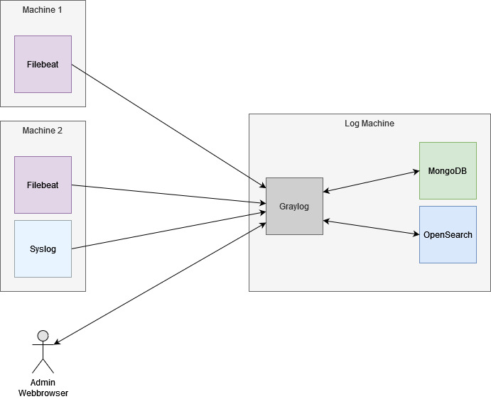

# Central Logging
Stack with Graylog, Elasticsearch, Kibana, and Filebeat all running in Docker containers.

## Purpose
Gather logs from various servers on a central Logging server.
In particular, logs from docker container and pods in Kubernetes cluster should be available in a web dashboard.

## Components




## Central Logging Server

In this section we will setup the central logging server. 
Is serves an instance of Graylog, Kibana, Elasticsearch, and Mongo, as well as a service to map certificates into graylog.

The webinterface of Graylog and Kibana will be available through the reverse proxy Traefik.

### Prerequisites
- Subdomain for Graylog
- Subdomain for Kibana
- Node e.g. VM

### Setup 

Open ports mentioned in `docker-compose.host.yml` and `docker-compose.traefik.yml` in your firewall. See section [VM Security Groups](#vm-security-groups).

Create DNS Entries for subdomains for `graylog` and `kibana` service.

Clone this repository on your node and `cd` into the directory.

Start reverse proxy Traefik if it is not already up and running on the node:

```shell
docker-compose -f docker-compose.traefik.yml up -d
```

Replace placeholder domain for `graylog` service with your subdomain in all files:
```shell
find . -type f -exec sed -i 's/logs.placeholderdomain.com/logs.mydomain.com/g' {} +
```

> The domain for graylog is used in multiple files such as `filebeat.yml` `.env.graylog.template` `docker-compose.host.yml` and `kubernetes-deploy/filebeat-daemonset.yaml`

Replace placeholder domain for `kibana` service with your subdomain in all files:
```shell
find . -type f -exec sed -i 's/kibana.placeholderdomain.com/kibana.mydomain.com/g' {} +
```

Copy `.env.graylog.template` and rename to `.env.graylog`:

```shell
cp .env.graylog.template .env.graylog
```

Set variables `GRAYLOG_ROOT_PASSWORD_SHA2` and `GRAYLOG_PASSWORD_SECRET` in `.env.graylog`.

Set Traefik Basic auth in `kibana` service in `docker-compose.host.yml`. To do so you may search for `traefik.http.middlewares.kibana-auth.basicauth.users`.

Set path to `acme.json` (`letsencrypt` dir in traefik) in `cert-extract` service in `docker-compose.host.yml`. To do so you may search for `/var/www/traefik/letsencrypt`

Start services:
```shell
docker-compose -f docker-compose.host.yml up -d
```

### VM Security Groups 
In order to restrict access to the VM security groups can be used. 
To allow web browsers and log agents like filebeat to access Graylog, 
some security groups have to be added to host VM:

- 80 (http)
- 443 (https)
- 5044
- 1514
- 12201

> You also may want to restrict access for certain subnet or hosts

### Certificates
To enable TLS for `Inputs`, certificates are needed. 
In this setup, these can be extracted from Traefik. 
For that following image is used in `docker-compose.host.yml`: https://hub.docker.com/r/soerenmetje/acme-certs-extract 
The volume `./certs` is used for sharing certificates.
In Graylog, go to Input configuration and set *TLS cert file* to `/usr/share/graylog/certs/flat/logs.placeholderdomain.com_full.crt`
and *TLS private key file* to `/usr/share/graylog/certs/flat/logs.placeholderdomain.com.key`.

### Plugins
Graylog plugins can be used too. 
Put the plugin `.jar` files in the `./plugins` directory.
The directory `./plugins` is mapped by a volume into the Graylog container.

#### Nice Plugins
- Graylog plugin for Telegram alert notifications: [TelegramAlert](https://github.com/irgendwr/TelegramAlert)

## Agents
- System Logs: Syslog
- Docker Logs: FileBeat

### Syslog
Syslog can be used to gather System logs.

When starting with plain Graylog, create a `Input` for Syslog first. This is an input type not a single machine.

Configure the machine to push the logs to the configured Graylog input


Create file `/etc/rsyslog.d/graylog.conf` and add following content:
```
*.* @@logs.placeholderdomain.com:1514;RSYSLOG_SyslogProtocol23Format
# @@ = TCP 
# currently unsecure
```

Reload config:
```shell
sudo systemctl restart rsyslog.service 
sudo systemctl status rsyslog.service 
```

### FileBeat
FileBeat is a log-shipper and can be used to gathering logs from f.e. Docker.

When starting with plain Graylog, create a `Input` for FileBeat first. This is a general input for multiple FileBeat services.

#### FileBeat to Ship Container Logs in Docker
Change hosts in `filebeat.yml` to your graylog subdomain, if not already done.

Start FileBeat:
```shell
docker-compose -f docker-compose.filebeat.yml up -d
```

#### FileBeat to Ship Container Logs in Kubernetes
Change hosts in `kubernetes-deploy/filebeat-daemonset.yaml` to your graylog subdomain, if not already done.

Start FileBeat:
```shell
kubectl apply -f ./kubernetes-deploy
```

> Namespace is set to `kube-system` in yaml-files

## Sources
- Graylog Docs Docker https://go2docs.graylog.org/5-0/downloading_and_installing_graylog/docker_installation.htm
- Graylog & co @ Docker https://docs.graylog.org/docs/docker
- Filebeat @ Docker gathering Docker logs: https://www.sarulabs.com/post/5/2019-08-12/sending-docker-logs-to-elasticsearch-and-kibana-with-filebeat.html
- Filebeat @ Docker gathering system logs: https://www.elastic.co/guide/en/beats/filebeat/7.17/running-on-docker.html
- ELK @ Docker: https://medium.com/geekculture/shoving-your-docker-container-logs-to-elk-made-simple-882bffdbcad6
- Secure communication with Logstash: https://www.elastic.co/guide/en/beats/filebeat/current/configuring-ssl-logstash.html
